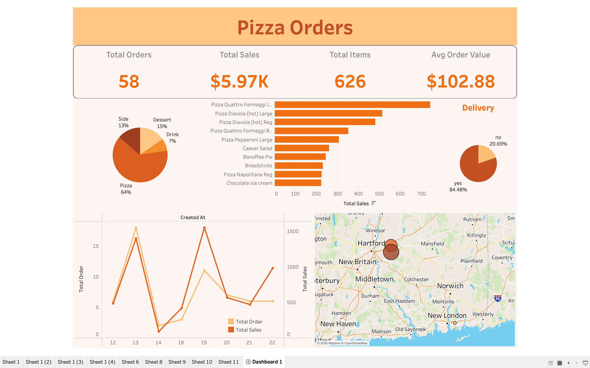

# Pizza Restaurant BI Solution: SQL Database Design & Interactive Tableau Dashboards 🍕📊

This repository contains an end-to-end Business Intelligence (BI) and Data Engineering solution for a pizza restaurant enterprise. The project covers the entire pipeline: from conceptual database design, SQL architecture development, and data manipulation to building advanced, interactive Tableau dashboards for executive business insights.

---

## 🚀 Project Architecture Overview
The solution bridges the gap between raw transactional data and strategic decision-making. 
1.  **Database Engineering (SQL):** Designed a relational database management system (RDBMS) to capture restaurant orders, inventory, ingredients, and staff schedules.
2.  **Data Transformation & Analytics:** Developed optimized SQL queries to clean, aggregate, and transform raw data into analytics-ready views.
3.  **Business Intelligence (Tableau):** Engineered dynamic dashboards to provide real-time tracking of operational performance, product popularity, and financial health.

---

## 🛠️ Tech Stack & Core Technologies
*   **Database Management:** MySQL (Relational Database Design)
*   **Data Querying & Analysis:** SQL (Advanced Joins, CTEs, Windows Functions, Aggregations)
*   **Business Intelligence & Visualization:** Tableau
*   **Conceptual Modeling:** Entity-Relationship Diagrams (ERD)

---

  

